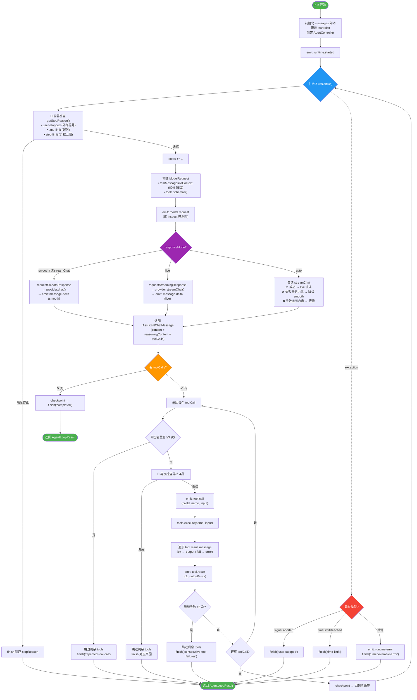

# AgentLoop 架构图

## 核心数据结构

| 概念 | 类型 | 说明 |
|------|------|------|
| `AgentLoopOptions` | `{ provider, tools, maxSteps?, maxDurationMs?, now? }` | 构造参数 |
| `AgentLoopRunInput` | `{ sessionId, turnId, responseMode?, messages, signal?, onEvent?, onCheckpoint? }` | 每次 run 的输入 |
| `AgentLoopResult` | `{ messages, stopReason, steps }` | 运行结果 |
| `AgentStopReason` | `'completed' \| 'user-stopped' \| 'time-limit' \| 'step-limit' \| 'repeated-tool-call' \| 'consecutive-tool-failures' \| 'unrecoverable-error'` | 停止原因 |
| `ResponseMode` | `'auto' \| 'live' \| 'smooth'` | 响应模式 |

## 关键设计决策

1. **上下文窗口管理** — `trimMessagesToContext` 从后往前保留完整对话轮次，最多使用 80% 上下文窗口
2. **流式降级** — `auto` 模式下，流式失败且未发送任何内容时自动降级到 `smooth`
3. **无限循环保护** — 默认最大 1000 步 / 2 小时，重复工具调用 3 次停止，连续失败 5 次停止
4. **事件驱动** — 通过 `onEvent` 回调实时推送 `runtime.started`、`model.request`、`tool.call`、`tool.result`、`message.delta`、`runtime.completed` 等事件
5. **检查点** — 每轮工具执行完毕后通过 `onCheckpoint` 保存消息快照
